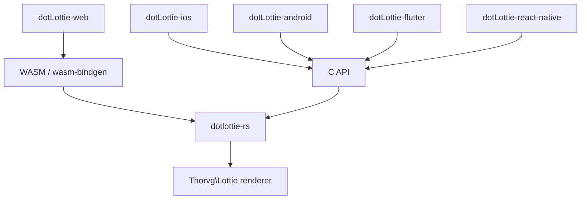

# dotLottie Rust


<p align="center">
  
</p>

<h1 align="center">dotLottie Rust</h1>

**dotlottie-rs** is the cross-platform [dotLottie](https://dotlottie.io/) runtime written in Rust. It is the engine powering all official dotLottie players — delivering the full dotLottie feature set (theming, state machines, multi-animation, and more) with guaranteed visual consistency across every platform.

It exposes a C API (via cbindgen) for native platforms and wasm-bindgen bindings for WebAssembly, serving as the core of the dotLottie players for [Web](https://github.com/LottieFiles/dotlottie-web), [Android](https://github.com/LottieFiles/dotlottie-android), [iOS](https://github.com/LottieFiles/dotlottie-ios), [Flutter](https://github.com/LottieFiles/dotlottie-flutter), and [React Native](https://github.com/LottieFiles/dotlottie-react-native).



## What is dotLottie?

dotLottie is an open-source file format that aggregates one or more Lottie files and their associated resources into a single file. They are ZIP archives compressed with the Deflate compression method and carry the file extension of ".lottie".

[Learn more about dotLottie](https://dotlottie.io/).

## Features

- **Cross-platform**: single Rust codebase targeting Android, iOS, Web, Flutter, React Native, and desktop
- **Guaranteed visual consistency**: powered by the [ThorVG](https://github.com/thorvg/thorvg) renderer across all platforms
- **Theming & slots**: runtime color, scalar, text, and vector slot overrides
- **State machines**: declarative interactivity engine with guards, transitions, and actions
- **Multi-animation**: playback control over multiple animations within a single `.lottie` file
- **dotLottie format**: full support for the `.lottie` container (ZIP-based, manifest v1 & v2, embedded assets)
- **C API**: cbindgen-generated header for native integration (Android NDK, iOS, desktop)
- **WASM**: wasm-bindgen bindings for WebAssembly targets

## Available Players

dotlottie-rs is the runtime core used by all official dotLottie framework players:

- [dotlottie-web](https://github.com/LottieFiles/dotlottie-web)
- [dotlottie-android](https://github.com/LottieFiles/dotlottie-android)
- [dotlottie-ios](https://github.com/LottieFiles/dotlottie-ios)
- [dotlottie-flutter](https://github.com/LottieFiles/dotlottie-flutter)
- [dotlottie-react-native](https://github.com/LottieFiles/dotlottie-react-native)

## Repository contents

- [Crates](#crates)
- [Development](#development)
- [License](#license)

## Crates

- [dotlottie-rs](./dotlottie-rs): The core library for dotLottie native players, including the C API (feature: `c_api`) and wasm-bindgen bindings (feature: `wasm-bindgen-api`)
- [examples/c_api](./dotlottie-rs/examples/c_api/demo-player.c): Example usage of the native C API

## Development

### Cross-Platform Release Builds

The following instructions cover building release artifacts for Android, Apple, WASM, Linux, and native platforms using the Makefile-based build system. For Rust development, just use `cargo` as usual — no special setup is needed.

You will need GNU `make` installed. Note that Apple platform targets (iOS, macOS, tvOS, visionOS) require a Mac with Xcode. To ensure that your machine has all the necessary tools installed, run the following from the root of the repo:

```bash
make setup
```

This will configure all platforms. You can also setup individual platforms using:
- `make android-setup` - Setup Android environment (requires Android NDK)
- `make apple-setup` - Setup Apple environment (requires Xcode)
- `make wasm-setup` - Setup WASM environment (installs wasm-pack and wasm32-unknown-unknown target)

### Performing builds

Builds can be performed for the following groups of targets:

- `android` - All Android architectures (ARM64, x86_64, x86, ARMv7)
- `apple` - All Apple platforms (macOS, iOS, tvOS, visionOS, macCatalyst)
- `wasm` - WebAssembly (software renderer) via wasm-bindgen
- `wasm-webgl` - WebAssembly with WebGL2 renderer via wasm-bindgen
- `wasm-webgpu` - WebAssembly with WebGPU renderer via wasm-bindgen
- `native` - Native library for current platform (C API via cbindgen)
- `native-opengl` - Native library with OpenGL renderer
- `native-webgpu` - Native library with WebGPU renderer
- `linux` - Linux x86_64 and ARM64

For `android` and `apple`, builds will be performed for all supported architectures, whereas
for `wasm`, only a single target will be built. These names refer to Makefile targets that can be
used to build them. For example, to build all `android` targets, execute the following:

```bash
make android
```

You can also build specific architectures:
```bash
make android-aarch64          # Android ARM64 only
make apple-macos-arm64        # macOS ARM64 only
```

The default target shows the help menu:
```bash
make                          # Shows comprehensive help
```

### Native C-API

The C bindings can be generated by using the following command, which will place the include and library
files in `release/native`:

```bash
make native
```

On Windows, you should use the `Makefile.win` make file:

```bash
make -f Makefile.win native
```

Examples for using the native interface can be found in the `examples` directory, which also contains a
[README](./examples/README.md) with information on getting started.

### Other useful targets

- `test`: Run all tests with single-threaded execution
- `clippy`: Run Rust linter with strict settings  
- `clean`: Clean all build artifacts and Cargo cache
- `list-platforms`: Show all supported platforms

For platform-specific cleanup:
- `android-clean`: Clean Android artifacts
- `apple-clean`: Clean Apple artifacts  
- `wasm-clean`: Clean WASM artifacts
- `native-clean`: Clean native artifacts

More information can be found by using the `help` target:

```bash
make help
```

### Release Process

Manually execute the `Create Release PR` Github Action workflow to create a release PR. This will
include all changes since the last release. This repo uses [changesets](https://github.com/changesets/changesets)
to determine the new release version. The [knope](https://github.com/knope-dev/knope) tool can be installed locally
and used to simply the creation of changeset files.

The release PR should be checked for correctness and then merged. Once that is done, the `Release`
Github Actions workflow will be started automatically to do the work of actually creating the new
release and building & uploading the related release artifacts.

### Relevant Tools

- [For your dotLottie creation and modification needs](https://github.com/dotlottie/dotlottie-js)
- [Tools for parsing Lottie animations](https://github.com/LottieFiles/relottie)

### License

[MIT](LICENSE) © [LottieFiles](https://www.lottiefiles.com)
