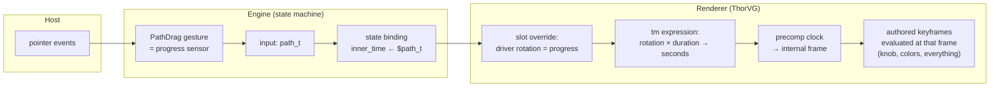
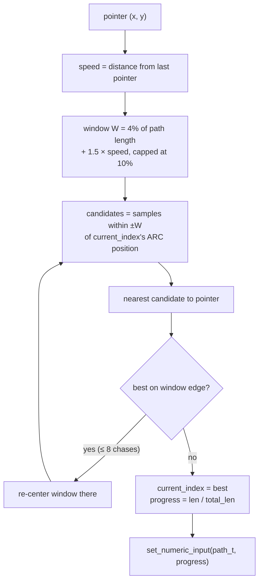
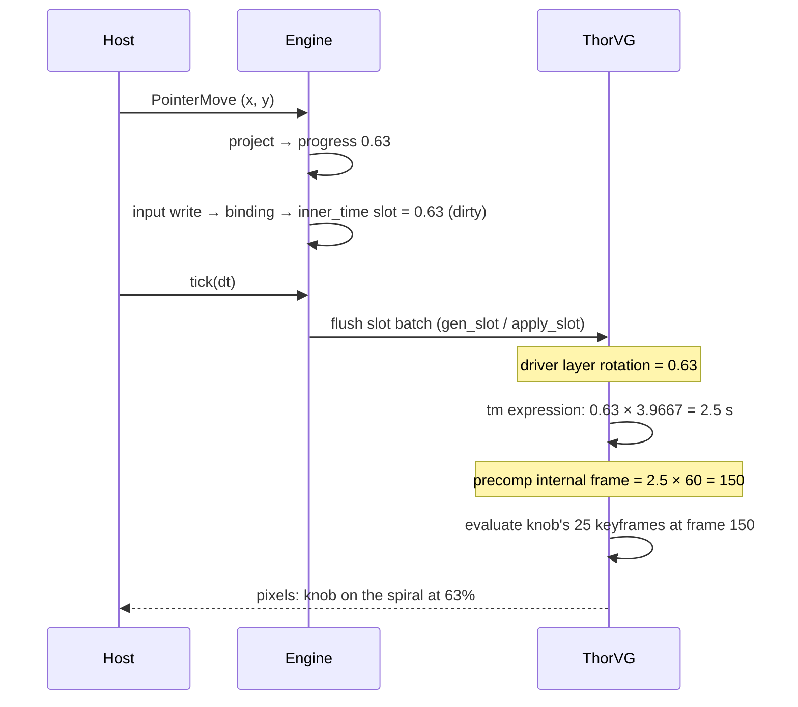

# How a PathDrag Moves the Thumb: the Full Pipeline

*Explainer for the PathDrag prototype (2026-07-22). Demo pair:
`assets/statemachines/spiral_drag.json` + `assets/animations/lottie/spiral_scrub.json`;
the same pipeline powers the curved slider (`slide_path_drag` + `slide_path_progress`).*

The mental model in one sentence: **the engine's entire output per pointer
move is a single number (progress); everything that looks like animation is
the renderer replaying authored keyframes at a scrubbed time.**



Three layers, three owners:

| Layer | Owns | Artifact |
|---|---|---|
| Gesture (engine) | pointer → progress, branch locality | `PathDrag` interaction |
| State machine | what progress *means* per state | one binding, guards |
| Animation (designer) | all motion, styling, easing | keyframes + `tm` bridge |

---

## Phase 1 — Grab (`PointerDown`)

1. The host posts `PointerDown {x, y}` — it knows nothing about paths.
2. The engine hit-tests the point against the **`knob` layer in the
   rendered scene** (works inside precomps, and wherever the knob currently
   sits).
3. On hit, the runtime **seeds branch locality**: a one-time *global*
   nearest-sample search sets `current_index` — the drag's memory of "where
   on the path we are." Global is safe exactly here: the pointer is *on*
   the knob, so the nearest path point is by definition the correct branch.
   Seeding also re-syncs after anything else moved the knob between drags.
4. The grab point is projected and published once (so a state entered by an
   `onGrab` hook binds against fresh values), then the gesture is held.

## Phase 2 — Drag (`PointerMove`): the engine's whole contribution

The path itself was extracted **once at load** from the animation JSON (the
`track` layer's bezier — vertices + tangents, works for layers inside
precomp assets) and flattened into an **arc-length sample table**: a few
hundred points, each knowing its cumulative distance along the curve.

Each pointer move runs the **windowed, branch-local projection**:



Why this shape (ported from the reference JS demo):

- **Branch protection**: the window is measured in *arc length*, so a
  spiral's neighboring turn — 57 px away spatially but a full turn away
  along the path — is never in the candidate set. The knob cannot tunnel
  sideways.
- **Fast pointers are chased**: the window grows with pointer speed, and if
  the best match sits on the window's edge, the search re-centers and runs
  again — following the pointer *along* the path, never across it.
- The knob's position on the path (`current_index`) is the single source of
  truth between events.

The winning sample yields `progress = len / total_len` ∈ [0, 1], and the
engine publishes **exactly one thing**:

```
set_numeric_input("path_t", 0.63)
```

That ordinary input write triggers the standard machinery synchronously:
the current state's live binding `inner_time ← "$path_t"` re-resolves and
writes 0.63 into the `inner_time` **scalar slot** — which only updates the
renderer's tracked slot map and flips a dirty flag. Note what has *not*
happened: no position computed, no layer moved. The engine is done, having
converted a pointer position into *"we are 63% along."*

## Phase 3 — Render (`tick`): where the number becomes motion



Step by step:

1. `flush_slots` hands the dirty slot batch to ThorVG — the hidden
   `time_driver` layer's **rotation** property is now 0.63. (Rotation
   because it is the one scalar, slot-supported transform property; the
   layer is invisible and offscreen, so "rotating" it shows nothing.)
2. ThorVG evaluates the precomp layer's **time remap** expression in its
   embedded JS engine: `$bm_rt = rotation × 3.9667` → seconds. `tm` severs
   the precomp from the parent timeline — this *is* the nested scene's
   clock. Internal frame = seconds × fps.
3. Ordinary Lottie playback does the rest, just at a scrubbed time: the
   knob layer's position is **25 authored keyframes** tracing the spiral
   (each keyframe's spatial tangents are the path's own bezier tangents, so
   between keyframes the knob interpolates along the *true curve*). The
   track color and anything else keyframed in the precomp evaluates at the
   same frame, for free.

Phases 1–2 are synchronous inside the pointer event; phase 3 lands on the
next tick (≤ 16 ms, frame-aligned).

---

## Why the knob lands exactly under the finger's projection

Two deliberate alignments make the sensor and the animation agree:

1. **Keyframe times are proportional to cumulative arc length** (the
   keyframes are generated that way), so "63% of arc" and "63% of timeline"
   are the same point on the curve. A designer *easing* those keyframes
   instead would deliberately make the drag feel weighted — that's a
   feature, not a bug.
2. **Frame interpolation is on** (player default), so fractional frames
   render smoothly rather than stepping at the authored frame rate.

## The severed-wire experiment

Deleting the `tm` expression from the animation cuts the pipeline exactly
between phase 2 and phase 3: the gesture still produces perfect progress
numbers, the binding still writes the slot, the driver still "rotates" —
and nothing on screen moves, while the precomp plays to the main timeline
again. (We ran this experiment; it is the clearest demonstration that `tm`
is the load-bearing coupling, and that gesture, state machine, and time
bridge fail independently.)

## Authoring checklist (per animation)

1. A named path layer (the constraint curve — first shape path is used).
2. A named grabbable layer.
3. The object's journey along the path as **keyframes inside a precomp**
   (arc-length-proportional timing for exact finger tracking).
4. The scrub bridge: hidden `time_driver` layer with
   `"r": {"a":0, "k":0, "sid": "inner_time"}`, a top-level `slots` entry for
   `inner_time`, and on the precomp layer
   `"tm": {"a":0, "k":0, "x": "var $bm_rt = thisComp.layer('time_driver').transform.rotation * <duration>;"}`.

Item 4 is a workaround for a ThorVG gap (no slot support on `tm` itself —
a `sid` there crashes). If native `tm` slots land upstream, the bridge
collapses to a single `sid` on `tm` and the expression disappears.

The state machine side is three lines of substance:

```json
{ "type": "DragAndDrop", "layerName": "knob", "pathLayerName": "track", "progressInput": "path_t" }
{ "slotId": "inner_time", "type": "Scalar", "value": "$path_t" }
{ "type": "Numeric", "name": "path_t", "value": 0 }
```

*(Historical note: this shipped as a separate `PathDrag` interaction and
was later folded into `DragAndDrop` as its path mode — `pathLayerName`
selects it.)*

## Code map

| Concern | Where |
|---|---|
| Path extraction (load-time, incl. precomp assets) | `src/lottie_renderer/slots/mod.rs` (`layer_paths_from_value`) |
| Sample table, windowed projection, seeding | `src/state_machine_engine/path_drag.rs` |
| Gesture lifecycle, hit-test, input publish | `src/state_machine_engine/mod.rs` (`manage_path_drag`) |
| Live binding re-apply on input write | `src/state_machine_engine/mod.rs` (`reapply_bound_state_slots`) |
| Slot flush to ThorVG (batched, per render) | `src/lottie_renderer/mod.rs` (`flush_slots`) |
| tm expression evaluation | ThorVG (`tvgLottieExpressions.cpp`, `$bm_rt` convention) |
| Tests | `tests/spiral_drag_check.rs`, `tests/path_drag_check.rs` |
