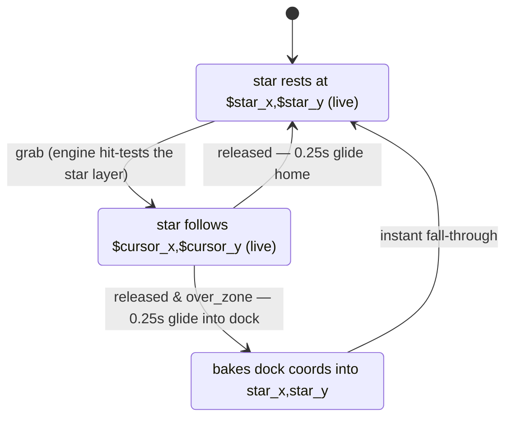

# RFC 0001 — State-Declared Slots

- **Status**: Draft
- **Date**: 2026-07-15
- **Prototype**: implemented and tested in dotlottie-rs (see [Prototype status](#prototype-status))
- **Related**: [state-slots.md](../spec-updates/state-slots.md) (full decision log), [state-slots-alternatives.md](../spec-updates/state-slots-alternatives.md), [slot-actions.md](../spec-updates/slot-actions.md) (the competing direction)

## Summary

Add an optional `slots` property to `PlaybackState` that declares the state's
*look* — values for the animation's slots — the same way a state already
declares `loop`, `speed`, or `segment`. Slot values apply when the state is
entered, **interpolate smoothly when entered via a `Tweened` transition**,
stay **live-bound to inputs** while the state is current, and release back
to their base values on exit.

This makes rich interactivity — including full drag & drop — authorable
inside a `.lottie` file with no host code beyond feeding inputs and
forwarding pointer events.

## Motivation

Slots already let themes and host APIs override animation properties
(colors, positions, sizes, …). What's missing is the *interactive* path: a
file-authored way for slot values to react to state changes and inputs, with
smooth transitions. Today that requires host code driving player APIs —
which breaks portability, the core promise of the format.

## Proposed spec changes

One addition to `PlaybackState`:

```json
{
  "type": "PlaybackState",
  "name": "alert",
  "slots": [
    { "slotId": "accent", "type": "Color",    "value": ["$heat", 0, 0] },
    { "slotId": "badge",  "type": "Position", "value": [80, 256] }
  ]
}
```

- `slotId`: the target slot in the active animation.
- `type`: `Color` | `Scalar` | `Vector` | `Position` (interpolable types
  only; Text/Image/Gradient are out of scope for v1 so that everything a
  state declares can tween).
- `value`: literal components, each optionally a `$`-prefixed **Numeric
  input reference**.

Semantics (each one sentence; details in the decision log):

1. **Apply on entry** — plain `Transition` → values apply instantly with the
   rest of state configuration.
2. **Tween on `Tweened` transitions** — values interpolate from their
   current values to the declared values on the transition's own
   `duration`/`easing` clock, alongside the existing frame-pose blend. Same
   state can be entered fast from one state, slow from another.
3. **Scoped lifetime** — leaving a state releases its declared slots back to
   their base values (active theme value, else authored animation value),
   tweening back symmetrically on tweened exits. Exactly the contract
   `loop`/`speed` already follow: undeclared = default.
4. **Live binding** — a declaration referencing inputs is a *standing rule*:
   while the state is current, changing a referenced input re-applies the
   slot immediately. The binding dies with the state.
5. **Silent no-op failures** — unknown `slotId`, type mismatch, or
   unresolvable reference skips that entry; nothing else breaks.

No new action types, no new transition types, no changes to themes,
interactions, guards, or inputs.

## Flagship use case: drag & drop, zero host logic

A star that can be picked up, dragged, and dropped onto a zone — the *entire*
behavior authored in the state machine. The host supplies only cursor
position inputs and standard pointer events.

```json
{
  "initial": "idle",
  "states": [
    { "name": "idle",
      "slots": [{ "slotId": "star_pos", "type": "Position",
                  "value": ["$star_x", "$star_y"] }],
      "transitions": [
        { "type": "Transition", "toState": "dragging",
          "guards": [{ "type": "Event", "inputName": "grab" }] }
      ] },
    { "name": "dragging",
      "entryActions": [{ "type": "SetBoolean", "inputName": "over_zone", "value": false }],
      "slots": [{ "slotId": "star_pos", "type": "Position",
                  "value": ["$cursor_x", "$cursor_y"] }],
      "transitions": [
        { "type": "Tweened", "toState": "docking", "duration": 0.25, "easing": [0.25, 0.1, 0.25, 1],
          "guards": [{ "type": "Event", "inputName": "released" },
                     { "type": "Boolean", "inputName": "over_zone", "conditionType": "Equal", "compareTo": true }] },
        { "type": "Tweened", "toState": "idle", "duration": 0.25, "easing": [0.25, 0.1, 0.25, 1],
          "guards": [{ "type": "Event", "inputName": "released" }] }
      ] },
    { "name": "docking",
      "entryActions": [{ "type": "SetNumeric", "inputName": "star_x", "value": 159.5 },
                       { "type": "SetNumeric", "inputName": "star_y", "value": 110.5 }],
      "slots": [{ "slotId": "star_pos", "type": "Position", "value": [159.5, 110.5] }],
      "transitions": [{ "type": "Transition", "toState": "idle" }] }
  ],
  "interactions": [
    { "type": "PointerUp", "layerName": "drop_zone",
      "actions": [{ "type": "SetBoolean", "inputName": "over_zone", "value": true }] },
    { "type": "PointerUp", "actions": [{ "type": "Fire", "inputName": "released" }] },
    { "type": "PointerDown", "layerName": "Star 2",
      "actions": [{ "type": "Fire", "inputName": "grab" }] }
  ]
}
```



Every piece maps to a spec feature: engine-side layer hit-testing
(interactions with `layerName`), guard priority as drop logic, live binding
as the drag itself, tweened transitions as the dock/return glide, and a
transient state baking coordinates into inputs for persistence. A four-object
version works the same way (validated in the prototype); it grows linearly
per object.

## Why state-declared slots, not slot actions

We explored the imperative alternative first — `SetColorSlot` /
`SetPositionSlot` / etc. actions that write a slot when executed
([full proposal](../spec-updates/slot-actions.md)). Both can set a slot;
they diverge on everything this RFC's use cases need:

| | State slots (this RFC) | Slot actions |
|---|---|---|
| Mental model | Declarative: *state = look* | Imperative: writes with history |
| Smooth transitions | Free — rides the `Tweened` transition's existing clock and easing, synchronized with the frame blend | Needs per-action `duration` plus a **new concurrent tween runner** with cancellation rules and non-blocking semantics |
| Per-transition timing | Yes (duration lives on the transition) | No (duration fixed by the action) |
| Cleanup on state change | Automatic — scoped release to theme/authored values | Manual — writes persist until explicitly reset; "passed through a state once, the color followed forever" |
| Reacting to input changes | Live binding, standing rule | One-shot; must re-fire on every change via extra interactions |
| Cursor-follow / drag | One declaration | An action re-executed per pointer event |
| Engine cost | No new machinery (reuses tween lifecycle, batched slot flush) | New tween runner + per-slot cancellation model |

Slot actions remain the right shape for *event-driven* writes not tied to a
state's lifetime (e.g. increment-style effects on `OnComplete`). But for
state-shaped styling — which is what interactive files overwhelmingly need —
the declarative model is strictly simpler for authors and for the engine.

## Known limitations (acknowledged, not blockers)

- **Coordinates are duplicated.** The drop zone's position appears in the
  state machine (dock literals + baked inputs) because declarations can't
  reference *layer* positions — only inputs. A future "layer position
  reference" would make the animation the single source of truth.
- **No expressions in bindings.** `["$cursor_x", …]` binds raw values;
  `$cursor_x - offset` is not expressible, so e.g. grab-offset needs host
  help (or future expression support).
- **Inputs freeze during tweens** (existing engine rule). Fine for short
  glides; a long tween ignores the cursor until it lands. Whether live-bound
  writes should be exempt is an open question.
- **One gesture at a time.** A single current state can't track two
  simultaneously dragged objects. Multi-touch drag needs a different
  primitive — a dedicated drag-and-drop interaction is the next exploration,
  deliberately out of scope for this RFC (since prototyped and proposed as
  [RFC 0002](./0002-drag-and-drop-interaction.md)).

## Prototype status

Fully implemented in dotlottie-rs as a test-purpose prototype: parsing,
instant apply, scoped release, transition-clock tweening, live binding, and
failure semantics — all covered by integration tests against the real
renderer (`tests/state_machine_state_slots.rs`,
`tests/drag_drop_pure_check.rs`, all green), with runnable demos
(`examples/state_slots.rs`, `cursor_binding.rs`, `drag_drop_pure.rs`,
`star_drop.rs`). No architectural changes were needed; the feature rides the
existing tween and slot machinery.
