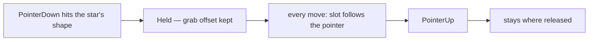
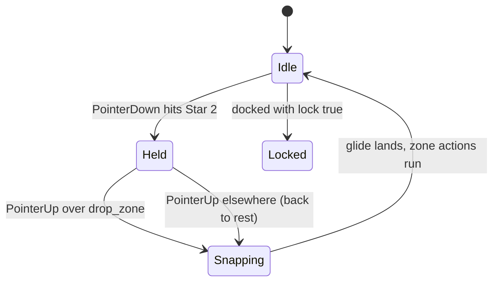
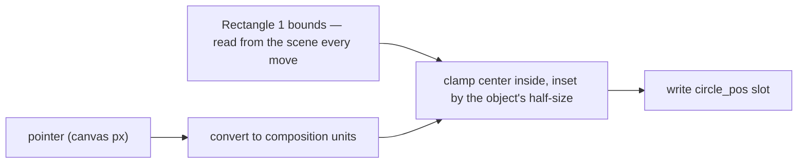
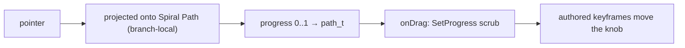
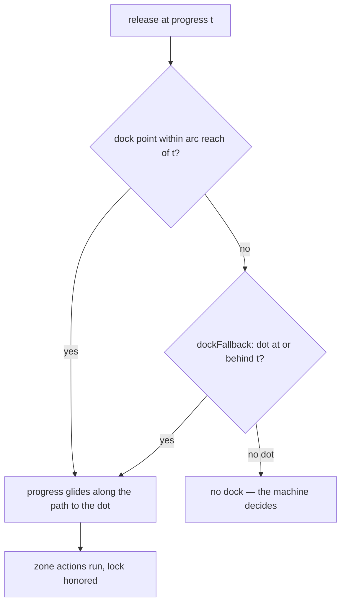

# RFC 0002 — The DragAndDrop Interaction

- **Status**: Draft
- **Date**: 2026-07-31
- **Prototype**: implemented and tested in dotlottie-rs; every rule below
  is prototype-verified

## Summary

Add one stateful interaction type, `DragAndDrop`, that owns the whole
drag gesture family. Optional fields select the behavior:

| Behavior | Selector | The object… |
|---|---|---|
| **Free** | *(none)* | follows the pointer and stays wherever it is released |
| **Drop zones** | `dropZones` | released over a zone it snaps there, otherwise it glides back |
| **Bounded** | `boundaryLayerName` | follows the pointer but cannot leave a layer's bounds |
| **Path** | `pathLayerName` | is projected onto an authored bezier; the gesture outputs only *progress* |

The state machine owns the *meaning* (states, guards, actions). The
interaction owns the *gesture* (pickup, constraint, drop zones, glides,
hooks). The animation owns the *geometry*: no coordinates and no frame
numbers are needed in the state machine JSON — positions, boundaries,
paths, and dock points are read from the scene or the animation at
runtime. (One escape hatch: a drop zone's optional `snap` override.)

### Conformance

The "Field reference" section is normative — it binds every conforming
player. Everything else is informative.

## Motivation

Drag gestures are everywhere in interactive content: slide to unlock,
snap a puzzle piece into place, drag an item into a cart, pull a knob
along a track. The state machine format cannot express any of them —
nothing in it connects a pointer to a layer's position — so every drag
today is custom pointer code, written per platform by a developer.

## Design principles

1. **Gestures are sensors.** A gesture turns pointer input into inputs
   (progress) and events (hooks). Everything visible is downstream —
   except that a free 2D drag has no timeline to scrub, so there the
   gesture writes a Position slot itself.
2. **The animation is the single source of geometry.** Dock points,
   boundaries, and paths are layers. Move or animate them and the
   behavior moves too.
3. **Slots are the only state channel.** Everything durable the engine
   writes goes through slots — serializable, cross-player, defined
   fallbacks. Sole exception: the drag ghost, a renderer-side visual
   that exists only between grab and landing and is observable by
   nothing.
4. **Read the scene, not the file.** Runtime geometry (positions,
   bounds, hit tests) comes from the rendered scene graph, so scale,
   parenting, and animation are honored. The one exception is path
   geometry, which is copied out of the animation JSON at load — see
   "Current costs".

## The interaction

### Free — drag anywhere

```json
{
  "type": "DragAndDrop",
  "layerName": "Star 2",
  "slotId": "star_pos"
}
```

No `dropZones`: lifecycle-only — the object stays wherever it is
released.



### Drop zones — snap and dock

```json
{
  "type": "DragAndDrop",
  "layerName": "Star 2",
  "slotId": "star_pos",
  "tween": { "duration": 0.25, "easing": [0.25, 0.1, 0.25, 1] },
  "dropZones": [
    { "layerName": "drop_zone", "lock": true,
      "actions": [{ "type": "Increment", "inputName": "docked_count" }] }
  ]
}
```



### Bounded — free drag inside a region

```json
{
  "type": "DragAndDrop",
  "layerName": "Ellipse 1",
  "slotId": "circle_pos",
  "boundaryLayerName": "Rectangle 1"
}
```



### Path — progress sensor with dock points

```json
{
  "type": "DragAndDrop",
  "layerName": "Ellipse 1",
  "pathLayerName": "Spiral Path",
  "progressInput": "path_t",
  "dockFallback": "previous",
  "tween": { "duration": 0.3, "easing": [0.25, 0.1, 0.25, 1] },
  "onGrab": [{ "type": "Fire", "inputName": "grab" }],
  "onDrag": [
    { "type": "SetNumeric", "inputName": "scrub", "value": "$path_t" },
    { "type": "Multiply", "inputName": "scrub", "value": 100 },
    { "type": "SetProgress", "value": "$scrub" }
  ],
  "onDrop": [{ "type": "Fire", "inputName": "release" }],
  "dropZones": [
    { "layerName": "drop_zone1" },
    { "layerName": "drop_zone4", "lock": true },
    { "layerName": "drop_zone0" }
  ]
}
```

The `onDrag` hook above converts the published progress into a timeline
scrub, so the knob's visible motion is its authored keyframes evaluated
at the scrubbed frame.



On release, the dock points decide what happens:



## Field reference

- `layerName` (required): the draggable layer. Pickup hit-tests
  `PointerDown` against the layer's actual rendered shape, not its
  bounding box — a star is not grabbed by the empty corners of its box.
- `slotId`: the Position slot written while dragging and snapping.
  Required in free/bounded modes; ignored in path mode.
- `pathLayerName` / `progressInput` (together): select **path mode**.
  While held, the pointer is projected onto `pathLayerName`'s first
  shape bezier and the normalized arc-length progress [0..1] is written
  to `progressInput`. The projection is branch-local (a windowed search
  along the path), so an adjacent turn of a spiral — close in space, far
  in arc length — can never capture the object. In this mode `slotId`
  and `boundaryLayerName` are ignored.
- `boundaryLayerName`: selects **bounded mode**. While held, the
  object's center is clamped into this layer's current oriented bounding
  box, inset by the object's own half-extents so the whole object stays
  inside, sliding along edges rather than sticking. Bounds are read from
  the scene every move, so scaled or animated boundaries are honored.
  Caveat: the clamp uses the layer's bounding *box*, not its silhouette.
- `stateName`: scope the gesture to a state. Grabbing only works while
  the named state is current, and leaving the state mid-drag cancels the
  gesture:
  - Free/bounded: a held object cancels to rest (through the `tween`
    glide if one is set) with no zone resolution and no `onDrop`; a
    release after the state has exited is likewise a cancel, not a drop.
    A ghost cancel discards the clone instantly (the original never
    moved). An **already-resolved snap glide is not cancelled** — its
    outcome was decided at release, so it lands and commits normally
    (zone actions included). Zone tracking pauses while the state is
    inactive and resumes on re-entry.
  - Path: the drag ends with no final publish and no hooks — progress
    freezes at its last published value; an in-flight dock glide is
    dropped the same way.

  Omitted = active in every state.
- `ghost` (default `false`, free mode): drag a frozen duplicate of the
  layer instead of the object itself — the file-manager feel. The
  original stays parked; a clone of its rendered paint rides the pointer
  above the whole animation. On a dock the clone retires at the release
  point and the original glides rest → zone through the normal slot
  tween; on a miss the clone glides back over the original and nothing
  else moves. The slot never changes during the drag, so everything
  downstream sees a stationary object until the drop commits. Constraints:
  the clone is a frozen snapshot (it does not animate while held); the
  boundary clamp is off, for the clone and for its landing write; a
  mid-glide clone must land before it can be re-grabbed; docking on a
  `track` zone skips the original's glide (tracking docks are instant);
  with no `dropZones` the slot is written once at the release point, so
  the original jumps there as the clone retires. This is the one
  deliberate exception to principle 3: the clone carries no state, and
  every durable outcome still flows through the slot.
- `tween`: duration (seconds) + cubic-bézier easing.
  - Free/bounded: the snap-in and return glides (omitted = instant).
    Non-blocking — the machine stays Running, and grabbing mid-glide
    cancels the glide and continues from wherever the object is.
  - Path: the dock glide, animated in *progress space* — the engine
    eases the progress input from the release point to the zone's
    on-path position, running `onDrag` each tick, so the object slides
    along the path into the dock.
  - Docking on a `track` zone is always instant: a tween cannot chase a
    moving target.
- `onGrab` / `onDrag` / `onDrop` (action lists): lifecycle hooks.
  - `onGrab` runs at pickup, after the gesture's sensor publishes.
    Grabbing also **un-docks**: any tracking stops.
  - `onDrag` runs on every held pointer move *and* on every dock-glide
    tick, always **after** the sensor publishes — its actions read a
    fresh `$progressInput`. This is the natural home for scrub
    pipelines.
  - `onDrop` runs on release, regardless of outcome (but not on
    state-scope cancellation); zone `actions` always run after it.
    Free/bounded run it before zone resolution; path runs it after the
    dock's progress write.
- `dockFallback` (path mode): what an *uncaptured* release does.
  `"previous"` ratchets to the nearest zone at or behind the release
  progress (detents); `"nearest"` goes to the closest zone in either
  direction (stepper). A fallback dock behaves exactly like a captured
  one. Omitted, or no qualifying zone: nothing docks and the machine
  decides (e.g. a release-guarded transition glides home).
- `dropZones` (ordered list; omitted or empty = **lifecycle-only**: no
  snap, no return). Free/bounded: zones match by hit-testing the release
  point against their rendered bounds (first declared hit wins) and the
  object snaps to the zone layer's current position; a miss returns it
  to where it was first grabbed. Path: zones are dock points on the
  path, captured by arc proximity. Each zone:
  - `layerName` (required).
  - `snap`: coordinate override (composition units) — the schema's
    single coordinate escape hatch; prefer a marker layer and omit it.
  - `lock` (default `false`): once docked here, the object can no longer
    be grabbed. `lock` on a terminal zone plus a gesture-scoped scrub is
    how a spent gesture retires itself (e.g. after an unlock).
  - `track` (default `false`, free mode): after docking, the engine
    *follows* the zone — each tick it reads the zone's transform
    position and rewrites the slot (an unchanged target skips the
    write). No expressions needed, and the slot always holds the real
    position, so tracked objects can be re-grabbed; the rest position
    follows too. The follow runs one canvas update behind the zone, and
    pauses while a `stateName`-scoped gesture's state is inactive.
    Ignored in path mode.
  - `actions`: run on dock — the bridge into normal state machine logic.

## Host requirements

The gesture is driven entirely by the pointer events the format already
defines: the host platform must forward `PointerDown`, `PointerMove`,
and `PointerUp` (with canvas-pixel coordinates) to the player. A host
that only forwards clicks or taps gets no drags. If the pointer stream
ends abnormally — pointer cancel, leaving the canvas, window blur — the
host should forward a `PointerUp` at the last known position so the
gesture resolves through the normal release path.

## Current costs

Four implementation costs are worth knowing. None blocks the design;
each has an engine-side mitigation today and disappears with a renderer
improvement.

- **Path geometry is copied from the animation JSON at load.** Path mode
  flattens the constraint bezier into an arc-length table once, with
  only static transforms composed — so an animated or morphing
  constraint path extracts wrongly. A renderer query for a layer's
  *evaluated* path would let the engine re-sample at grab time and
  remove the limitation — and would also let bounded mode clamp against
  a boundary's real silhouette instead of its bounding box.

- **Dragging re-applies the whole slot set every frame.** Slot changes
  reach the renderer as one serialized JSON batch that the renderer
  re-parses, so each dragged frame pays for *every* active slot — theme
  colors, text, all of it — to move one position slot. The same happens
  each tick while a `track` dock follows a moving zone. Pointer moves
  within a frame already coalesce into one application, and the gesture
  slot can be split into its own batch so the per-frame JSON shrinks to
  a few bytes. A typed set-one-slot renderer API would remove the JSON
  round-trip entirely.

- **Scene queries walk the tree by layer name.** The boundary clamp
  reads bounds every move; tracking reads a transform every tick. The
  renderer rebuilds layer scenes each frame, so handles cannot be
  cached and every query is a by-name walk — cheap on small scenes,
  linear on large ones. An O(1) layer lookup in the renderer fixes it.

- **Scene reads are one frame stale.** Bounds, transforms, and hit tests
  reflect the scene as of the last canvas update — which is why a
  `track` follow runs one update behind its zone, and a bounded drag
  clamps against where a moving boundary was on the previous frame.
  Self-consistent (picking and geometry lag identically), and invisible
  at interactive speeds; a renderer option to query the just-updated
  scene would remove the lag entirely.

## Open questions

- **Naming**: a path-mode or lifecycle-only declaration neither
  drags-to-a-drop nor drops. `Drag` (with zones as one optional feature)
  is likely the better spec name; trivial now, harder after circulation.
- **Unscoped gestures**: `stateName` gives scoped gestures a defined
  cancel. For unscoped gestures, what happens to a held object when a
  transition swaps the animation, a theme resets slots, or the machine
  stops mid-gesture? Prototype behavior: gesture writes win until the
  slot is clobbered. The spec could simply require `stateName`.
- **Slot writes vs paint writes**: a proof of concept drives drags by
  composing transforms onto rendered layer paints (no slot needed, and
  drags compose with playing animations). It is a renderer-private
  channel with real costs and a spec-level fork (delta model vs this
  proposal's absolute slot model). Parked; this proposal stays on slots.
  The `ghost` option deliberately samples that world for the one job
  slots cannot express — a second transient copy of a layer.
- **Multi-pointer**: simultaneous drags of different objects are
  structurally supported, but pointer identity is not modeled (two
  touches = one stream today).
- **Capture generosity**: arc reach scales with content but not with
  path length — on a long path, dock points get proportionally harder to
  hit. A per-zone `captureRadius` is the plausible knob; excluded from
  v1.
- **Grab exclusivity**: should the topmost draggable win, instead of
  every overlapping one grabbing? Needs renderer z-order queries;
  deferred until a real asset needs it.
- **Capability negotiation**: does the format need a
  `requires`/feature-version declaration? Bigger than this RFC.
- **Scope discipline**: v1 deliberately excludes axis locking,
  hover-over-zone feedback, z-order lifting, and inertia.

## Alternatives considered

- **Expression-bound tracking**: one slot write carrying a
  position-following expression. Zero per-frame engine work, but it
  requires an expressions-capable player and loses the object's real
  position (forcing `lock`). Replaced by engine-driven `track`.
- **Bounds-center snap targets**: docking at the zone's visual bbox
  center plus anchor compensation. Replaced by transform-position reads,
  which restore exact authored semantics; the center survives only as
  the fallback.
- **Separate `PathDrag` interaction**: merged in as path mode — same
  gesture, different constraint.
- **Sensor outputs** (`xInput`/`yInput`/`zoneInput`): inputs
  continuously fed the object's position and docked-zone index. No
  machine consumer ever emerged, so they were removed for API surface
  discipline; they should return only with a demonstrated use case (and
  zone identity would come back as the zone's *layer name*, not a
  fragile index).
